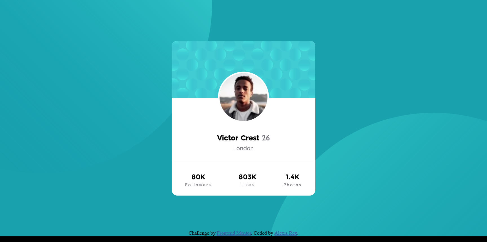

# Frontend Mentor - Profile card component solution

This is a solution to the [Profile card component challenge on Frontend Mentor](https://www.frontendmentor.io/challenges/profile-card-component-cfArpWshJ). Frontend Mentor challenges help you improve your coding skills by building realistic projects. 

## Table of contents

- [Overview](#overview)
  - [The challenge](#the-challenge)
  - [Screenshot](#screenshot)
  - [Links](#links)
- [My process](#my-process)
  - [Built with](#built-with)
  - [What I learned](#what-i-learned)
  - [Continued development](#continued-development)
- [Author](#author)


## Overview

### The challenge

- Build out the project to the designs provided

### Screenshot



### Links

- Solution URL: [Add solution URL here](https://your-solution-url.com)
- Live Site URL: [Add live site URL here](https://your-live-site-url.com)

## My process

### Built with

- Visual Studio Code 2021
- CSS custom properties
- Flexbox
- Mobile-first workflow


### What I learned

Use this section to recap over some of your major learnings while working through this project. Writing these out and providing code samples of areas you want to highlight is a great way to reinforce your own knowledge.

To see how you can add code snippets, see below:

```html
<hr>
```
```css
@media screen and (max-width:600px) {
    body {
        background-position: -375px -322px;
        background-size: 113%;
    }
    
    div.bg-2{
        background-size: 113%;
        background-position: 314px 463px;
    }

    div.card {
        width: 460px;
        height: 500px;
    }

    div.card img.profile {
        height: 140px;
    }
 
}
```

### Continued development

Want to work on developing projects with multiple background layers that comes with challenging positioning and sizes 

## Author

- Frontend Mentor - [@alexisrex08](https://www.frontendmentor.io/profile/alexisrex08)
- Instagram - [@justal3xis](https://www.instagram.com/justal3xis/)

